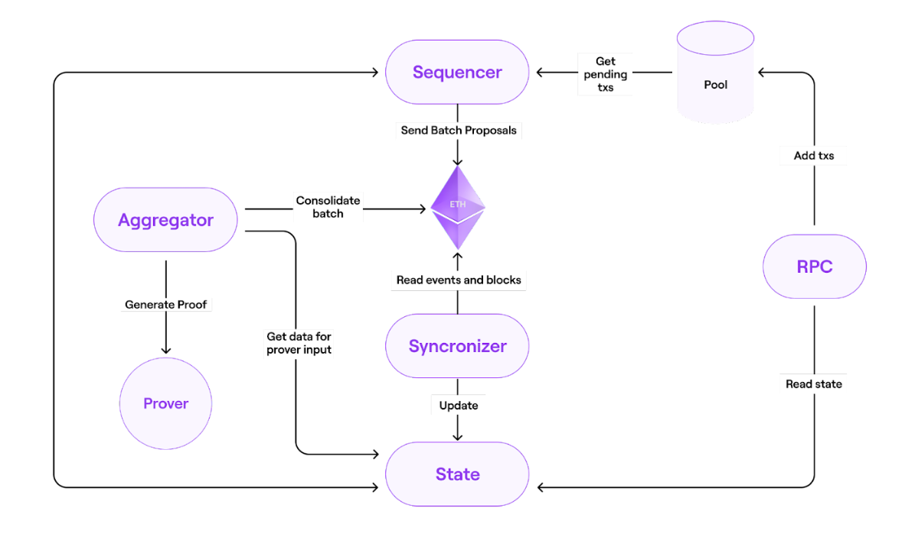

## Introduction

A zkNode is the software needed to run a zkEVM node. It is a client that the network requires to implement the synchronization and govern the roles of the participants (Sequencers or Aggregators). Polygon zkEVM participants will choose how they participate:

- As a node to know the state of the network, or
- As a participant in the process of batch production in any of the two roles: **Sequencer** or **Aggregator**

The zkNode Architecture modular in nature. You can check out the diagram below for more clarity.

## Sequencers

A **Sequencer** receives L2 transactions from the users, preprocesses them as a new L2 batch, and then proposes the batch to the PoE smart contract as a valid L2 transaction. The **Sequencer** receives **transactions from users** and will **receive all fees** from all published transactions. Sequencer is therefore economically incentivized to post valid transactions in order to profit the most from them. A **Transaction Pool** with a sorting algorithm to choose the most profitable transactions is often used to solve this.

While publishing a series of transactions, the **Sequencer** must pay a **fee in MATIC** tokens. This sum will change depending on the pending batches that need to be validated. If a sequencer shows malicious behavior by **posting invalid transactions** or **creating batches with just one transaction**, the protocol ensures that it will be very expensive to break the chain. This ensures that publishing invalid transactions will result in a loss for the sequencer.

Sequencers can be either **Trusted** or **Permissionless**:

### Trusted

**Trusted sequencers** are added to the network in order to achieve **fast finality**. The trusted sequencers predicts what the state will look like before it’s actually virtualized on L1.

### Permissionless

To improve decentralization of the Polygon zkEVM, we allow permissionless sequencers to run on the network. Anyone with required hardware setup can initialize their own zkNode and participate as an independent, censor-resistant, **permissionless sequencer** in the network.

## Aggregators

An **Aggregator** receives all the transaction information from the Sequencer and sends it to the **Prover** (or zkProver) which provides a byte-sized zk-Proof after complex polynomial computations. The Smart Contract validates this proof. This way, an **Aggregator** collects the data, sends it to the **Prover**, receives its output and finally, sends the information to the smart contract to verify that the **Validity Proof** from the **Prover** is correct.

The **MATIC** fee paid by the sequencers will be given to the aggregators. If the chain is overloaded with batches, the **MATIC cost will increase**, which will better incentivize the aggregators to generate verifiable proofs. The total cost of running aggregators is calculated by two factors: L1 transaction cost, and Server costs (to be defined).

## Synchronizer

Other than sequencing and validating processes, the zkNode also enables synchronisation of batches and their validity proofs, which happens only after these have been added to L1. This is accomplished using a subcomponent called the **Synchronizer**.

A **Synchronizer** is responsible for getting all the data from Smart Contracts, which includes the data posted by the **sequencers** (transactions) and the data posted by the **aggregators** (validity proofs). All this data is stored in a huge database and served to third parties through a service called **JSON-RPC**.

The Synchronizer is responsible for reading the events from the Ethereum blockchain, including new batches to keep the state fully synced. The information read from these events must be stored in the database. The Synchronizer also handles possible reorgs, which will be detected by checking if the last `ethBlockNum` and the last `ethBlockHash` are synced.

## RPC

RPC (Remote Procedure Call) is a JSON-RPC interface compatible with Ethereum. For a software application to interact with the Ethereum blockchain (by reading blockchain data and / or sending transactions to the network), it must connect to an Ethereum node. RPC enables integration of the zkEVM with existing tools, such as Metamask, Etherscan, and Infura. It adds transactions to the **Pool** and interacts with the **State** using read-only methods. 

## State

This subcomponent implements the Merkle Tree and connects to the DB backend. It checks integrity at the block level (information related to gas and block size, among others) and some transaction-related information (signatures, sufficient balance). It also stores the Smart Contract code into the Merkle tree and processes transactions using EVM.

## zkProver

All the rules for a transaction to be valid are implemented and enforced in the zkProver. A zkProver performs complex mathematical computations in the form of polynomials and assembly language. These are later verified on a Smart Contract.

These rules could be seen as constraints that a transaction must satisfy in order to be able to modify the state tree or the exit tree. The zkProver is the most complex module which required development of two new programming languages to implement the needed elements. Its detailed architecture is outlined [here](/docs/zkEVM/Architecture/zkProver).